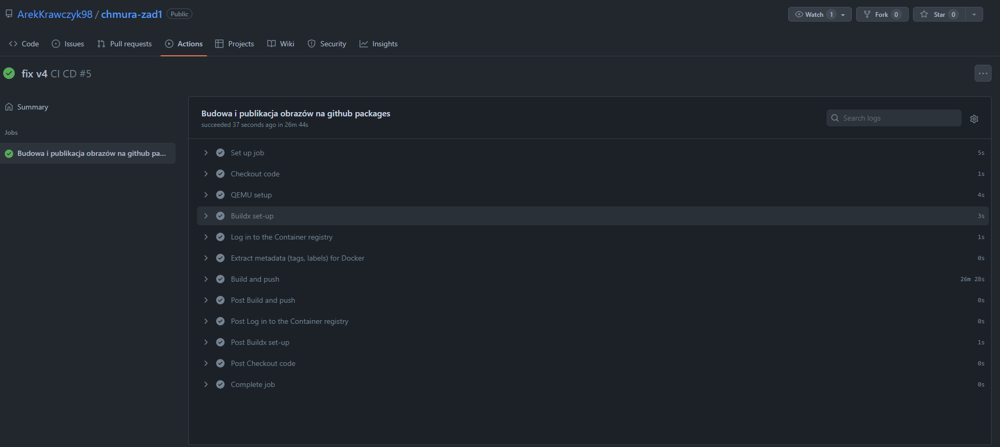

## Programowanie Full-stack w chmurach obliczeniowych
#### Arkadiusz Krawczyk 88729, Informatyka – studia niestacjonarne 1.1/1
### Zadanie 1

Aplikację zbudowano przy pomocy framework’a Spring Boot w języku Kotlin.

Na rysunku 1.1 jest widoczna klasa, która jest odpowiedzialna za obsługę żądań wysyłanych poprzez metodę GET na adres http://<domyślnie localhost>:8080
Metoda getRequestIP obiektu HttpUtils jest odpowiedzialna za “zebranie” IP z obiektu HttpServletResponse.
Następnie w kolejnej linii jest sprawdzane, czy adres IP jest lokalny (0:0:0:0:0:0:0:1, gdy aplikacja działa na maszynie lokalnej lub 172.17.0.1, gdy aplikacja działa w kontenerze działającym na lokalnej maszynie)czy zewnętrzny.
Kolejnym krokiem jest wyświetlenie czasu na podstawie poprzez pobranie czasu lokalnego oraz strefy lub poprzez wysłanie żądania do zewnętrznego API, gdy IP nie jest lokalne.

Rys. 1.1

Na rysunku 1.2 jest widoczna klasa główna Springa, która posiada metodę startup, która pozostawia w logach odpowiednie informacje o autorze, czasie uruchomienia aplikacji oraz porcie na którym nasłuchuje aplikacja.
Metoda ta wywoła się po tym jak ziarno Springa o nazwie chmura1Application zostanie utworzone.

Rys. 1.2

### Zadanie 2

Utworzono następujący Dockerfile (rys 2.1).
Nie skorzystano z warstwy scratch ze względu na napotkane problemy podczas budowania aplikacji - czas budowania aplikacji przy pomocy narzędzia Gradle wydłużał się 4-5 krotnie z przyczyn, których nie udało się zlokalizować i rozwiązać.

Rys. 2.1

Zdecydowano się na użycie multi-stage build przy pomocy gotowych, lżejszych wersji obrazów. W 1 etapie używamy obrazu z JDK, są kopiowane wszystkie wymagane pliki do budowy aplikacji, a kolejnie następuje jej budowa za pomocą gradle-wrappera, dzięki czemu nie musimy dodawać do obrazu narzędzia gradle, a jedynie korzystamy z wrappera, który pozwala korzystać z narzędzia bez jego instalacji.
W drugim etapie został użyty obraz z JRE, następnie skopiowano zbudowany plik wykonywalny jar z 1 etapu i umieszczono instrukcję do uruchomienia aplikacji.

### Zadanie 3

1. Do budowy obrazu użyto polecenie `docker build -t chmura-1 .` z następującym efektem

Rys. 3.1
2. Uruchomienie obrazu `docker run -p 8080:8080` 

Rys. 3.2. Można zauważyć że dodana metoda wywołana przy starcie aplikacji, oprócz danych o autorze nie jest potrzebna, ponieważ Spring automatycznie umieszcza w logach przy starcie aplikacji informacje na temat portu na którym aplikacja nasłuchuje żądań przychodzących oraz umieszcza informacje o czasie.
3. Do testów użyto polecenia `curl http://localhost:8080`. Można tutaj zauważyć, że strefa czasowa jest określona jako UTC - dzieje się tak ze względu, że jest to strefa czasowa kontenera na którym działa aplikacja.

Rys. 3.3. Aby dokładniej sprawdzić działanie aplikacji skorzystano z narzędzia `ngrok`, które służy jako reverse-proxy. Udostępnia w chmurze publiczny adres, którego ruch jest następnie przekazywany do procesu ngrok, a następnie do lokalnej aplikacji/serwera.
Użyto, polecenia `ngrok http 8080`, które dało następujący wynik:

Rys. 3.4. Następnie jeszcze raz wykorzystano polecenie curl z nowym adresem

Rys. 3.5.
4. Wynik polecenia `docker inspect chmura-1` pokazującego informacje o obrazie w tym jego warstwach.

Rys. 3.6

### Zadanie 4

Nie udało się stworzyć obrazu na 3 architektury ze względu na to że obrazy na których bazuje Dockerfile, nie posiadają w zdalnym repozytorium obrazów na architekturę linux/arm/v7, więc stworzono obrazy na architektury linux/arm64/v8 oraz linux/amd64.
Zostało to zrealizowane za pomocą następującego polcenia `docker buildx build -t arekk41051/chmura-zad1 --platform linux/amd64,linux/arm64/v8 --push .`, które jednocześnie przesłało je na DockerHub.

Rys. 4.1

Link do zdalnego repozytorium: https://hub.docker.com/repository/docker/arekk41051/chmura-zad1

### Zadania dodatkowe

Utworzono plik yaml dla github actions, który buduje obraz przy wrzuceniu commita na gałąź main oraz następnie wysyła go do zdalnego repozytorium GitHub Packages

Rys. 5.1

Rys. 5.2

Rys. 5.3

